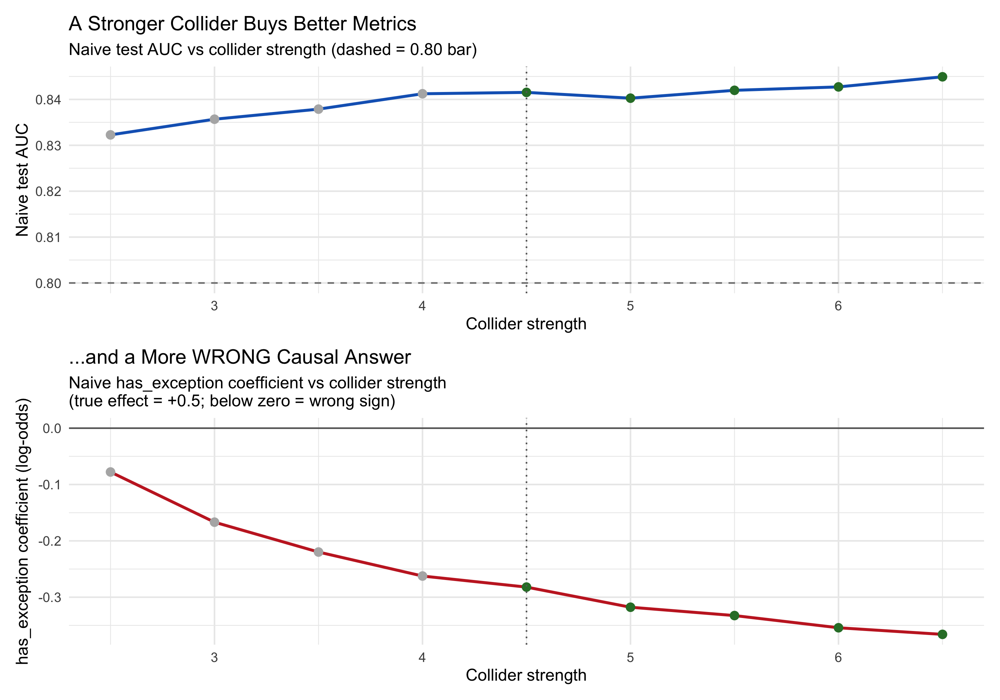

```{r setup}
#| include: false
library(here)
library(dplyr)
library(broom)
library(ggplot2)
library(knitr)

# Source the framework. All numbers in this document are computed live from
# these functions, so the narrative can never drift from the code.
source(here::here("R", "01_define_dag.R"))
source(here::here("R", "02_simulate_data.R"))
source(here::here("R", "03_naive_models.R"))
source(here::here("R", "04_causal_models.R"))
source(here::here("R", "06_validate_ground_truth.R"))
source(here::here("R", "07_comparison_plots.R"))

set.seed(2026)
SIM_N <- 50000

# Generate the dataset once and reuse it throughout the document.
df <- simulate_delivery_data(n_customers = SIM_N, seed = 2026)
df_num <- df |> mutate(churn_numeric = as.numeric(as.character(churned)))

# Helper: extract the has_exception log-odds from a glm formula
logodds <- function(formula) {
  unname(coef(glm(formula, data = df_num, family = binomial()))["has_exception"])
}

# Helper: marginal ATE (percentage points) via g-computation from a glm
ate_pp <- function(formula) {
  m  <- glm(formula, data = df_num, family = binomial())
  d1 <- df_num |> mutate(has_exception = 1L)
  d0 <- df_num |> mutate(has_exception = 0L)
  mean(predict(m, d1, type = "response") - predict(m, d0, type = "response")) * 100
}

inline_pp <- function(x) sprintf("%+.1f pp", x)
```

> **Reproducibility note.** Every figure and every number in this document is
> *computed live* when the page is rendered (seed = `2026`,
> `r format(SIM_N, big.mark = ",")` simulated customers). Nothing is hard-coded.
> If you change the data-generating process, this explanation updates itself.

# The Problem: A Model That Recommends the Absurd

Imagine a logistics company that has trained a high-accuracy churn model. One of its
strongest signals is **delivery exceptions** (that is errors, for example late or failed 
deliveries). The model reports that customers who experience exceptions are *less* 
likely to churn.

Taken literally, the recommendation is: **slow your deliveries down to retain
customers.** No operator would ship that. So the model is an excellent *predictor* and
a terrible *decision tool*, and the gap between those two things is what causal
inference exists to close.

This document builds a small, fully-simulated "in-silico laboratory" where we **know
the true answer**, deliberately build the model a competent analyst would ship, watch
its single best feature poison the causal answer, and then show how a causal workflow
recovers the truth.

# Why Prediction ≠ Causation

Predictive models answer *"given what I observe, what is likely?"* Causal questions
ask *"if I intervene and change X, what happens to Y?"* A variable can be wonderfully
predictive yet causally misleading, and conditioning on the wrong variables can flip
an estimate's sign entirely.

The headline failure we engineer on purpose is:

1. **Collider bias (Berkson's paradox)**: a variable we must *exclude*, and the
   single most *predictive* feature in the data. The naive model can't resist it,
   and that is exactly what poisons the causal answer.

A second classic trap also lives in this data as a backdrop:

2. **Simpson's Paradox** — a confounder we must *include*. It reverses the raw
   aggregate comparison and explains why the causal adjustment set adds
   `order_volume`, but it is *not* what breaks the naive model here, because the
   naive model (the kitchen-sink) already includes the confounder.

# The Scenario and Its Causal Map

The business question is: **does experiencing a delivery exception cause a customer to
churn? And by how much?** The data-generating process embeds the following causal structure.

```{r dag}
#| fig-cap: "The causal DAG. Order_Volume is a confounder (a backdoor path); Support_Ticket is a collider; Impatience is an unmeasured (latent) cause."
dag_results <- define_causal_dag()
dag_results$plot
```

The variables and their causal roles:

| Variable | Causal role | Observed? | Plain-English meaning |
|---|---|:---:|---|
| `has_exception` | **Treatment** | ✅ | Did the customer hit a delivery problem? |
| `churned` | **Outcome** | ✅ | Did the customer leave? |
| `order_volume` | **Confounder** | ✅ | Engagement / order frequency |
| `opened_support_ticket` | **Collider** | ✅ | Caused by exceptions *and* impatience |
| `impatience` | **Latent cause** | ❌ | A personality trait we never measure |
| `monthly_spend_usd` | Precision covariate | ✅ | Sharpens the estimate |
| age, emails, logins | Noise | ✅ | Distractors we can drop |

Crucially, `impatience` is generated but **never returned in the dataset**, exactly as
in real life, where you rarely get to measure the thing you most wish you could.

## The True Effect (the thing we get to know)

Because we wrote the simulation, we know the "ground truth" exactly:

```{r ground-truth}
truth <- get_ground_truth_ate()
```

- The **structural effect** of an exception on churn is `r truth$log_odds` on the
  log-odds scale.
- The **true marginal Average Treatment Effect (ATE)**: the change in churn
  *probability* if everyone (vs no one) experienced an exception, computed by
  g-computation on the data-generating process, is
  **`r inline_pp(truth$ate_pp)`**.

In words: exceptions genuinely *increase* churn by roughly
`r round(truth$ate_pp, 1)` percentage points. Let's keep that number in mind; it's the
target every model is trying to hit.

# Trap #1: Collider Bias (Berkson's Paradox) is the headline trap

A support ticket is opened when a customer is annoyed enough to complain. Two things
drive that: a delivery **exception**, and the customer's underlying **impatience**.
Because the ticket has two arrows pointing *into* it, it is a **collider**.

Conditioning on a collider opens a non-causal path between its parents, manufacturing a
spurious association between `has_exception` and (via impatience) `churn`. And here's
the twist: the ticket is also the single most *predictive* feature of churn,
precisely why a predictive-first workflow will keep it, and precisely why doing so
poisons the causal estimate.

**The fix is to REMOVE the collider** (never adjust for it).

# Trap #2: Simpson's Paradox (Confounding) is the backdrop still in the data

High-volume, highly-engaged customers place many orders. More orders means more
opportunities for something to go wrong, so they encounter **more** exceptions. But
those same loyal customers churn **less**. `order_volume` therefore influences both the
treatment and the outcome we are studying here: the textbook definition of a confounder.

The consequence is a sign reversal between the aggregate and the strata:

```{r simpsons-fig}
#| fig-cap: "Within every order-volume decile, customers WITH a delivery exception (red) churn more than those without (blue). Yet exception customers cluster in the high-volume, low-churn deciles, so the AGGREGATE comparison reverses."
plot_simpsons_paradox(df)
```

```{r simpsons-numbers}
agg_diff <- (mean(df_num$churn_numeric[df_num$has_exception == 1]) -
             mean(df_num$churn_numeric[df_num$has_exception == 0])) * 100
mean_vol_exposed   <- mean(df$order_volume[df$has_exception == 1])
mean_vol_unexposed <- mean(df$order_volume[df$has_exception == 0])
```

The mechanism in numbers:

- **Aggregate:** exception customers appear to churn `r sprintf("%.1f", abs(agg_diff))`
  percentage points *less* — the illusion.
- **Where the exposed live:** their mean order-volume is
  `r sprintf("%+.2f", mean_vol_exposed)` versus
  `r sprintf("%+.2f", mean_vol_unexposed)` for everyone else. They sit squarely in the
  loyal, low-churn region.
- **Within each decile:** the relationship flips back to positive — the truth.

**The fix is to ADD the confounder** to the model, closing the backdoor path.

# The In-Silico Laboratory

The reason we can *prove* any of this is that the data is simulated. We know the true
ATE, so we can grade each modeling choice against it. Let `dagitty` tell us, purely
from the assumptions encoded in the DAG, which variables we must adjust for:

```{r adjustment-set}
adj <- get_adjustment_strategy(dag_results$dag)
adj
```

```{r adjustment-vars}
#| include: false
adj_vars <- unlist(adj)
```

The minimal sufficient adjustment set is **{ `r paste(adj_vars, collapse = ", ")` }**,
it includes the confounder and, importantly, it does **not** include the collider.

## Designing the laboratory: the collider is calibrated on purpose

The headline phenomenon, a naive kitchen-sink model with genuinely good
metrics (test AUC ~ 0.84) and a wrong-signed effect, is not an accident of
the simulation; it is a **design requirement**, and `R/08_dgp_calibration.R`
is the design document. That script grid-searches the collider's strength
and the latent trait's effect on churn against this explicit **headline
contract**, positive and meaningful true effect, genuinely good naive
metrics, a decisive wrong sign, causal recovery, collider isolation, and
realistic prevalence rates; then selects the *weakest* collider that still
breaks the headline. The chosen design: collider strength **4.5** on both
parents, latent impatience effect **1.5** on churn, and a ticket intercept
of **-5.1** (keeping the observed ticket rate near a realistic 25%).

```{r dgp-calibration-fig, out.width = "100%", fig.cap = "The in-silico lab's design trade-off: as the collider gets stronger, the naive model's AUC rises (top) while its `has_exception` coefficient sinks further below zero (bottom). Green points pass the headline contract; the dotted line marks the chosen design."}

```

The two panels are the thesis made visible: better metrics and worse advice
are two faces of the same coin. A drift guard at the end of the script
re-reads the constants actually coded in `R/02_simulate_data.R` and fails
loudly if they ever diverge from this calibration.

> **Note:** I calibrated the collider so that its bias exceeds the
> true +0.5 log-odds effect. That is legitimate (and it is the point) in
> an in-silico laboratory: it demonstrates that good metrics provide *no*
> protection against a bad adjustment set.

# The Two Recipes

Both pipelines use the same `tidymodels` machinery; they differ only in which variables
they keep.

**The naive (predictive-first) recipe** is a kitchen-sink specification: every
observed feature a competent analyst would include goes in: the confounder
(`order_volume`) *and* the collider (`opened_support_ticket`, which looks far
too predictive to leave out). Its one causal error is conditioning on the
collider:

```{r naive-recipe}
#| eval: false
recipe(churned ~ ., data = train) |>
  update_role(customer_id, new_role = "ID") |>
  step_dummy(all_nominal_predictors()) |>
  step_normalize(all_numeric_predictors())
# every observed predictor is kept, including the collider
# opened_support_ticket (the single causal mistake)
```

**The DAG-guided causal recipe** does the opposite: adds the confounder, drops the
collider and the noise:

```{r causal-recipe}
#| eval: false
recipe(churned ~ ., data = train) |>
  update_role(customer_id, new_role = "ID") |>
  step_rm(opened_support_ticket,    # drops the collider   (the key move)
          customer_age_years, marketing_emails_clicked, app_logins_last_7_days) |>
  step_dummy(all_nominal_predictors()) |>
  step_normalize(all_numeric_predictors())
# order_volume is RETAINED
```

# The Reveal

```{r estimates}
true_ate   <- truth$ate_pp
naive_ate  <- ate_pp(churn_numeric ~ has_exception + order_volume +
                       monthly_spend_usd + opened_support_ticket +
                       customer_age_years + marketing_emails_clicked +
                       app_logins_last_7_days)
causal_ate <- ate_pp(churn_numeric ~ has_exception + order_volume + monthly_spend_usd)

results <- tibble(
  Method = c("Ground Truth (DGP)",
             "Naive model (kitchen-sink: keeps every feature, incl. the collider)",
             "Causal model (add confounder, drop collider)"),
  `ATE (pp)` = c(true_ate, naive_ate, causal_ate),
  `Bias (pp)` = c(0, naive_ate - true_ate, causal_ate - true_ate),
  Direction = c("Increases churn",
                ifelse(naive_ate > 0, "Increases churn", "DECREASES churn (WRONG)"),
                ifelse(causal_ate > 0, "Increases churn", "Decreases churn"))
)
kable(results, digits = 1, caption = "Marginal ATE: the naive model gets the sign wrong; the causal model recovers the truth.")
```

```{r money-shot}
#| fig-cap: "The money shot. The naive estimate (red) sits on the wrong side of zero; the causal estimate (blue) lands on the true effect (green line)."
comparison_tbl <- tibble(
  Method = c("Ground Truth (DGP)", "Naive Model (Kitchen-Sink / Collider)", "Causal Model (DAG-Guided)"),
  ATE_pp = c(true_ate, naive_ate, causal_ate)
)
plot_ground_truth_comparison(comparison_tbl)
```

The naive model concludes exceptions **`r ifelse(naive_ate < 0, "reduce", "increase")`**
churn (`r inline_pp(naive_ate)`) (the absurd recommendation we started with). The
causal model recovers **`r inline_pp(causal_ate)`**, essentially the true
`r inline_pp(true_ate)`.

## How the Estimate Moves Across Specifications

It is instructive to watch the `has_exception` coefficient migrate as we change the
adjustment set:

```{r trajectory}
#| fig-cap: "Only the DAG-guided specification (add confounder, drop collider) lands near the true structural coefficient."
plot_coefficient_trajectory(df)
```

```{r trajectory-numbers}
traj <- tibble(
  Specification = c("Aggregate (exception only)",
                    "Naive ML (kitchen-sink: every feature)",
                    "DAG-guided (+ confounder + spend)",
                    "Over-adjusted (DAG + collider)"),
  `log-odds` = c(
    logodds(churn_numeric ~ has_exception),
    logodds(churn_numeric ~ has_exception + order_volume +
              monthly_spend_usd + opened_support_ticket +
              customer_age_years + marketing_emails_clicked +
              app_logins_last_7_days),
    logodds(churn_numeric ~ has_exception + order_volume + monthly_spend_usd),
    logodds(churn_numeric ~ has_exception + order_volume + monthly_spend_usd + opened_support_ticket)
  )
)
kable(traj, digits = 3, caption = "has_exception log-odds across specifications.")
```

# An Last Accounting

A causal demo is only worth as much as its honesty about its own assumptions.

## Why we headline the ATE, not the logistic coefficient

```{r noncollapsibility}
causal_logodds <- logodds(churn_numeric ~ has_exception + order_volume + monthly_spend_usd)
```

The DAG-guided **log-odds** coefficient is `r sprintf("%.3f", causal_logodds)`, a little
below the structural `r truth$log_odds`. This is **not bias**, it is the well-known
**non-collapsibility** of the odds ratio: when a strong cause of the outcome
(`impatience`) is unmeasured, the conditional odds ratio shrinks toward the null even
when the model is correctly specified.

The **marginal ATE on the probability scale is collapsible**, so it recovers the truth
(`r inline_pp(causal_ate)` vs `r inline_pp(true_ate)`). It is also the number a business
actually wants: *"if we eliminated exceptions, churn would fall by about this much."*
That's why it's our headline estimand.

## Uncertainty: a bootstrap confidence interval

```{r bootstrap}
boot <- bootstrap_ate_ci(df, n_bootstrap = 500, seed = 2026)
```

A percentile bootstrap gives a 95% confidence interval for the causal ATE of
**[`r sprintf("%.1f", boot$CI_Lower)`, `r sprintf("%.1f", boot$CI_Upper)`] pp** comfortably
away from zero and bracketing the true effect.

## Robustness: how strong an unmeasured confounder would have to be

Since `impatience` is exactly the kind of variable we can never measure, we quantify the
finding's fragility with an **E-value** (VanderWeele & Ding, 2017):

```{r evalue}
or_causal <- exp(causal_logodds)
ev <- compute_evalue(or_causal)
```

With a causal odds ratio of `r sprintf("%.2f", or_causal)`, the E-value is
**`r sprintf("%.2f", ev$evalue)`**. In plain terms: an unmeasured confounder would need
to be associated with *both* the exception and churn by a factor of at least
`r sprintf("%.2f", ev$evalue)`× ,beyond everything already adjusted for, to explain the
effect away. That is a demanding bar, which gives us confidence in the result.

# Field Guide: What to Do with Each Type of Variable

The whole workflow compresses into one decision table. For each variable, identify
its role in the DAG, then the include/exclude decision is mechanical:

| Variable type | DAG structure | Include in model? | Consequence of getting it wrong | In this project |
|---|---|---|---|---|
| **Confounder** | `X ← Z → Y` | ✅ **YES** (mandatory, per the adjustment set) | **Omitted-variable bias / Simpson's Paradox.** The model attributes Z's spurious correlation to X: it can even flip the sign (like the ice cream "causes" shark attacks). | `order_volume` |
| **Collider** | `X → C ← Y` (or `← U →`) | ❌ **NO** (never adjust) | **Collider / Berkson's bias.** Conditioning on C *opens* a non-causal path between its parents, manufacturing a spurious association. | `opened_support_ticket` |
| **Mediator** | `X → M → Y` | ❌ NO for the **total** effect / ✅ YES only for the **direct** effect (with mediation methods) | **Overcontrol bias.** The estimate shrinks toward the direct effect; M "steals" the indirect pathway (smoking → tar → cancer). | *(none, by design)* |
| **Descendant of the outcome** | `Y → D` | ❌ **NO** | A form of collider/selection bias: conditions on information from the outcome itself, biasing toward the null. | the ticket is also downstream of the latent cause of churn |
| **Precision covariate** | `Z → Y` only (no arrow into X) | ✅ YES (recommended, not required) | Omitting it does **not** bias the estimate, you just lose precision (wider intervals). | `monthly_spend_usd` |
| **Instrument-like (predicts treatment only)** | `Z → X` only (no arrow into Y) | ⚠️ NO as a covariate | Doesn't bias, but **inflates variance** of the treatment effect; can *amplify* residual confounding bias (Z-bias). Use as an **instrument** (IV/2SLS) instead, if valid. | *(none)* |
| **Noise** | disconnected from X and Y | ❌ NO (harmless but useless) | Wasted degrees of freedom; invites overfitting and spurious "importance". | age, emails, logins |
| **Latent / unmeasured confounder** | `U → X`, `U → Y`, unobserved | 🚫 CANNOT include | Residual confounding. Quantify robustness with **sensitivity analysis (E-value)**. | `impatience` |

Three rules fall out of this table for this case:

1. **Confounders go IN**: or the backdoor stays open (Trap #2).
2. **Colliders and outcome-descendants stay OUT**: or you open a backdoor yourself (Trap #1).
3. **What you cannot measure, you stress-test**: hence the E-value above.

# Prediction vs. Causation: Do We Pay for the Fix?

A fair question: by dropping the most predictive feature (the collider), did the causal
model sacrifice predictive power? Let's measure it honestly on a held-out test set:

```{r predictive-power}
#| cache: false
set.seed(123)
split <- initial_split(df, prop = 0.8, strata = churned)
train <- training(split)
test  <- testing(split)

naive_fit  <- glm(churned ~ has_exception + order_volume + monthly_spend_usd +
                    opened_support_ticket + customer_age_years +
                    marketing_emails_clicked + app_logins_last_7_days,
                  data = train, family = binomial())
causal_fit <- glm(churned ~ has_exception + order_volume + monthly_spend_usd,
                  data = train, family = binomial())

eval_auc <- function(fit) {
  tibble(truth = test$churned,
         .pred_1 = predict(fit, test, type = "response")) |>
    yardstick::roc_auc(truth, .pred_1, event_level = "second") |>
    pull(.estimate)
}

auc_tbl <- tibble(
  Model = c("Naive (kitchen-sink: keeps every feature, incl. the collider)",
            "Causal (keeps confounder, drops collider)"),
  `Test AUC` = c(eval_auc(naive_fit), eval_auc(causal_fit))
)
kable(auc_tbl, digits = 3, caption = "Held-out predictive performance (ROC AUC).")
```

```{r predictive-power-numbers}
#| include: false
auc_naive  <- auc_tbl$`Test AUC`[1]
auc_causal <- auc_tbl$`Test AUC`[2]
```

Here the trade-off is explicit: the causal model fixes the effect estimate at
the cost of discrimination (AUC `r sprintf("%.3f", auc_causal)` vs
`r sprintf("%.3f", auc_naive)`). The collider *is* genuinely predictive, it
acts as a proxy for the unmeasured impatience, so removing it costs AUC.
Giving up those points buys the difference between a sign-flipped estimate
and the right decision.

The general lesson is exactly this trade-off: a collider can carry real
predictive information, and here dropping it *does* cost a few points of
AUC. When that trade-off appears, remember the two models answer **different
questions**: one predicts *who* will churn, the other tells you *what to do about it*,
and only the second is safe to act on.

# Reproduce This Yourself


```r
# 1. Activate the environment (exact package versions via rv)
source("rv/scripts/activate.R")

# 2. Regenerate every figure and the validation output
source("R/05_generate_figures.R")

# 3. Run the test suite (asserts both traps emerge and the causal model wins)
testthat::test_dir("tests/testthat")

# 4. Re-render this document
quarto::quarto_render("docs/causal-framework-explained.qmd")
```

Everything is seeded (`seed = 2026`), so your results will match these exactly.

# Takeaways

1. **A great predictor can give terrible advice.** Predictive importance is not causal truth.
2. **Draw the DAG first.** Encoding assumptions makes the right adjustment set a mechanical question, answered here by using some `dagitty` functions.
3. **In a case like this, Confounders go IN, colliders stay OUT.** Here the naive model's one
   error was keeping the collider; the fix drops it, and adds the confounder
   that any aggregate comparison silently needs.
4. **Simulate to validate.** An in-silico laboratory is the only place you can grade a causal method against a known truth.
5. **Report decision-relevant, honest effects.** Prefer the collapsible marginal ATE, attach a CI, and stress-test with an E-value.

# References

- Pearl, J. (2009). *Causality: Models, Reasoning, and Inference.*
- Hernán, M.A. & Robins, J.M. (2020). *Causal Inference: What If.*
- VanderWeele, T.J. & Ding, P. (2017). "Sensitivity Analysis in Observational Research: Introducing the E-Value." *Annals of Internal Medicine.*
- Elwert, F. & Winship, C. (2014). "Endogenous Selection Bias: The Problem of Conditioning on a Collider Variable."
- Greenland, S., Robins, J.M., & Pearl, J. (1999). "Confounding and Collapsibility in Causal Inference."
